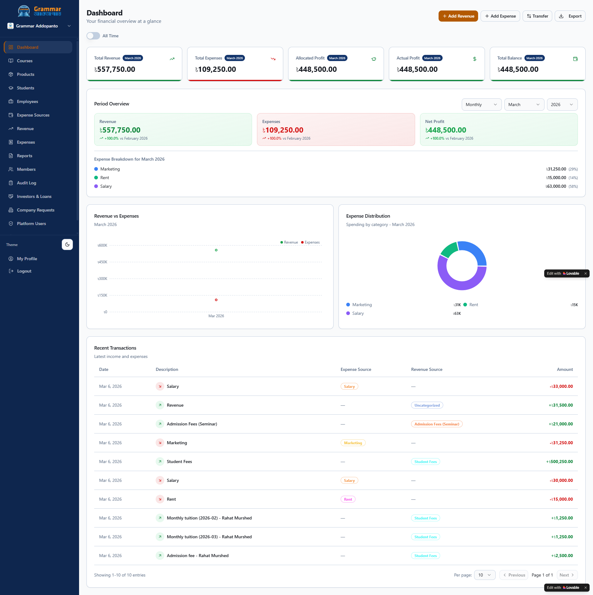
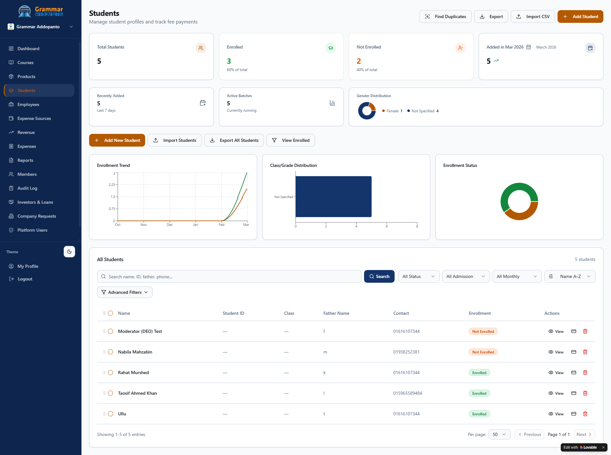
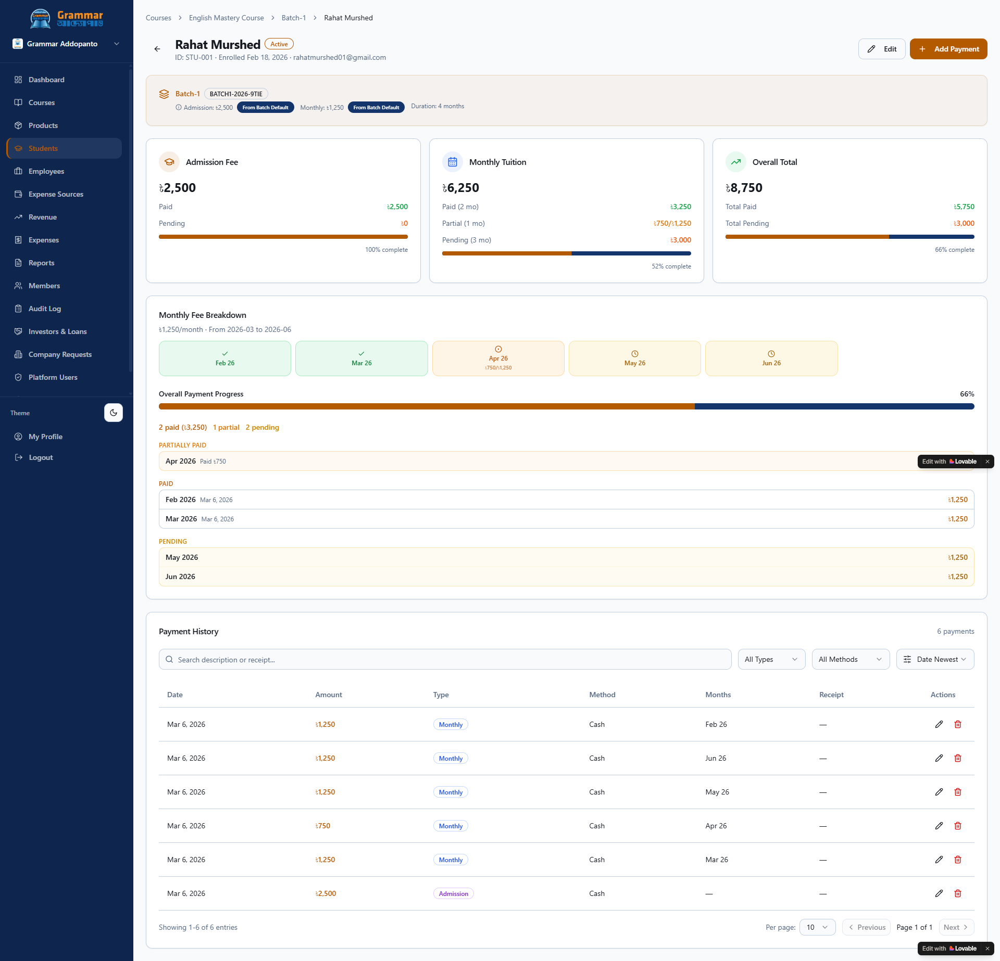
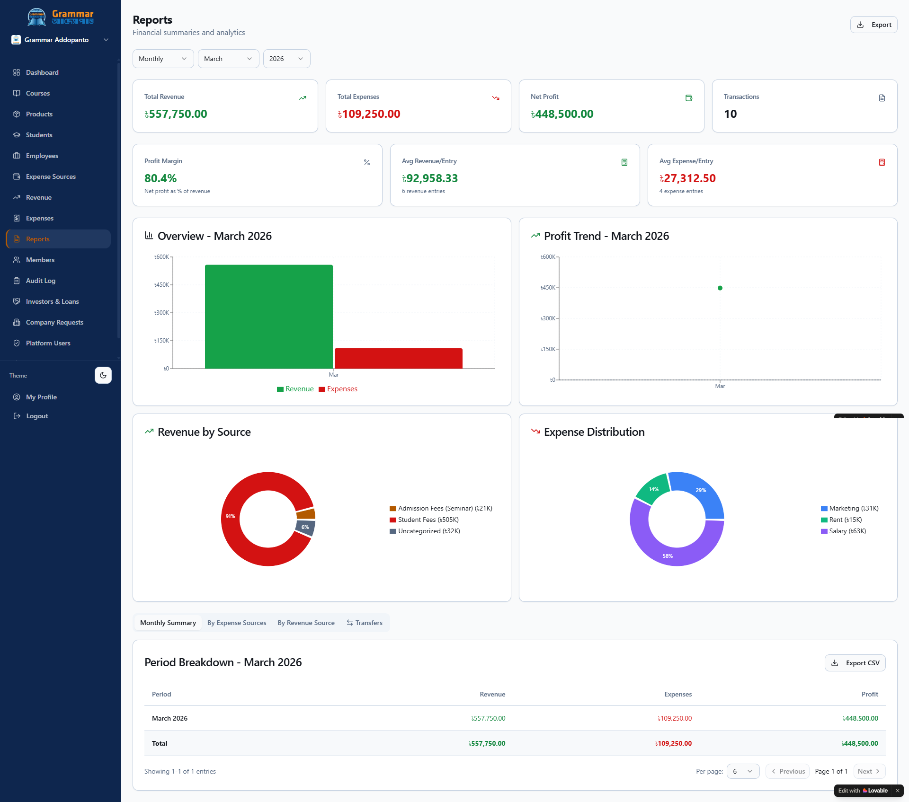

<div align="center">

# Addopanto Flow

**Multi-tenant financial management for educational institutions**

[](https://react.dev)
[](https://www.typescriptlang.org)
[](https://vitejs.dev)
[](https://tailwindcss.com)
[](https://supabase.com)
[](https://www.framer.com/motion)
[](#)
[](#)

[Live Demo](https://addopantoflowdemo.lovable.app) · [Report Issue](../../issues)

</div>

---

## What Is This?

Addopanto Flow is a complete back-office platform purpose-built for schools, coaching centers, and academies. If your institution currently manages fee collection, payroll, expense tracking, and investor obligations across separate spreadsheets or disconnected tools — this replaces all of them. Everything lives in one place, access is controlled by role, and every financial action leaves a traceable record.

For those running multiple branches or organizations, the platform supports full data isolation per organization under a single login. Administrators define who sees what, operators enter data within their permitted scope, and nothing crosses organization boundaries.

From an engineering perspective, this is a React 18 single-page application backed by Supabase with row-level security enforced at the database layer — not the application layer. Every table is scoped to a `company_id`. The access control model implements a five-tier role hierarchy with 30+ granular permission flags per membership. Dashboard aggregations run as server-side Postgres RPC functions, all mutations are captured in an append-only audit log, and real-time state is synchronized through Supabase Realtime channels.

---

## Features

### Financial Management
- Allocate incoming revenue proportionally across named expense accounts (Khatas)
- Record and categorize expenses with vendor details, invoice numbers, and receipt uploads
- Transfer funds between expense accounts with full transfer history
- View profit/loss dashboards with period-over-period comparison

### Student Management
- Enroll students through a multi-step wizard capturing personal, contact, family, and academic details
- Track admission fees and monthly tuition with per-student payment histories
- Detect overdue payments automatically and surface them in a dedicated section
- Assign students to batches individually or in bulk
- Import students via CSV and export filtered lists to CSV or PDF
- Detect and merge duplicate student records across batches
- View lifetime value, enrollment timeline, and financial breakdown per student profile

### Course · Batch System
- Create courses with codes, categories, and duration
- Schedule batches under courses with start/end dates, capacity limits, and default fee structures
- Track enrollment counts against batch capacity
- Auto-complete batches when their end date passes

### Employee · Payroll
- Maintain employee records with personal details, qualifications, banking information, and employment type
- Record monthly salary payments with deduction breakdowns
- Track employment status transitions (active, on leave, terminated)

### Investor · Loan Tracking
- Record investments with ownership percentages, profit-sharing terms, and receipt verification
- Manage loan disbursement workflows including gross amount, deductions, and net disbursed figures
- Track loan repayments with principal/interest splits and remaining balances
- Allocate investor and loan funds to specific expense accounts with compliance tracking

### Product Sales
- Organize products into categories with custom icons and colors
- Maintain inventory with stock quantities, reorder levels, and supplier links
- Record sales tied to students or walk-in customers with payment status tracking
- View stock movement history for every adjustment and sale

### Reports · Exports
- Generate date-filtered revenue and expense summaries
- Compare current period performance against previous periods
- Export any data view to CSV or generate PDF reports with institutional branding

### Multi-Organization Support
- Create isolated organizations with their own data, currency, and fiscal year settings
- Request new organization creation (reviewed by platform administrators)
- Join existing organizations via invite code and password
- Switch between organizations without logging out

### Access Control
- Five-tier role hierarchy: **Cipher** (platform owner) › **Admin** › **Moderator** › **Data Entry Operator** › **Viewer**
- 30+ granular permission flags per membership covering finance, students, batches, employees, and reports
- PII restriction banners for roles without sensitive data access
- Permission assignment interface for admins to configure moderator and operator capabilities

### Audit · Security
- Append-only audit log capturing every create, update, and delete operation with before/after snapshots
- Row-level security on every table — no data crosses organization boundaries
- Dashboard access logging with anomaly detection
- Rate limiting on sensitive operations

---

## Screenshots

> Automatically adapts to your system's dark or light preference.

**Dashboard** — Revenue metrics, expense allocation, profit tracking, and period-over-period comparison

<picture>
  <source media="(prefers-color-scheme: dark)" srcset=".github/screenshots/screencapture-addopantoflow-lovable-app-dashboard-2026-03-06-17_49_47.png">
  <source media="(prefers-color-scheme: light)" srcset=".github/screenshots/screencapture-addopantoflow-lovable-app-dashboard-2026-03-06-17_49_56.png">
  
</picture>

<br/>

**Student Management** — Enrollment stats, batch distribution, and a searchable student directory with bulk actions

<picture>
  <source media="(prefers-color-scheme: dark)" srcset=".github/screenshots/screencapture-addopantoflow-lovable-app-students-2026-03-06-17_35_15.png">
  <source media="(prefers-color-scheme: light)" srcset=".github/screenshots/screencapture-addopantoflow-lovable-app-students-2026-03-06-17_35_22.png">
  
</picture>

<br/>

**Student Payment Detail** — Admission fee, monthly tuition breakdown, payment progress, and full payment history

<picture>
  <source media="(prefers-color-scheme: dark)" srcset=".github/screenshots/screencapture-addopantoflow-lovable-app-students-bace19a4-e629-4be8-b2b7-aaa8fb8e0742-2026-03-06-17_44_05.png">
  <source media="(prefers-color-scheme: light)" srcset=".github/screenshots/screencapture-addopantoflow-lovable-app-students-bace19a4-e629-4be8-b2b7-aaa8fb8e0742-2026-03-06-17_43_54.png">
  
</picture>

<br/>

**Reports** — Date-filtered financial summaries with revenue by source, expense distribution, and CSV export

<picture>
  <source media="(prefers-color-scheme: dark)" srcset=".github/screenshots/screencapture-addopantoflow-lovable-app-reports-2026-03-06-17_50_44.png">
  <source media="(prefers-color-scheme: light)" srcset=".github/screenshots/screencapture-addopantoflow-lovable-app-reports-2026-03-06-17_50_29.png">
  
</picture>

---

## Tech Stack · Architecture

| Layer | Technology | Role |
|-------|------------|------|
| UI Framework | React 18.3 | Component architecture with lazy-loaded route splitting |
| Language | TypeScript 5.8 | End-to-end type safety across client and database types |
| Build Tool | Vite 5.4 | Sub-second HMR, optimized production builds |
| Styling | Tailwind CSS 3.4 + shadcn/ui | Design token system with Radix UI primitives |
| Backend | Supabase | Auth, Postgres, Row-Level Security, Edge Functions, Realtime |
| Data Fetching | TanStack React Query 5 | Server state with automatic cache invalidation and optimistic updates |
| Routing | React Router 6 | Nested layouts, protected routes, lazy loading |
| Charts | Recharts 2 | Responsive SVG charts for dashboard visualizations |
| Animation | Framer Motion 12 | Page transitions, micro-interactions, layout animations |
| Validation | Zod 3 + React Hook Form 7 | Schema-driven form validation with type inference |
| PDF Export | jsPDF + html2canvas | Client-side PDF generation with institutional branding |
| Monitoring | Sentry | Error tracking with source maps in production |
| Date Handling | date-fns 3 | Immutable, tree-shakeable date operations |

---

## Installation · Local Setup

### Prerequisites

- Node.js 18+ and npm
- A Supabase project (or use the connected Lovable Cloud instance)

### Steps

```bash
# 1 ― Clone the repository
git clone https://github.com/RahatMurshed/Addopanto-Flow.git
cd Addopanto-Flow

# 2 ― Install dependencies
npm install

# 3 ― Configure environment variables
cp .env.example .env
```

Edit `.env` with your values:

```env
VITE_SUPABASE_URL=https://your-project.supabase.co
VITE_SUPABASE_PUBLISHABLE_KEY=your-anon-key
VITE_SUPABASE_PROJECT_ID=your-project-id
```

```bash
# 4 ― Apply database migrations
npx supabase db push
```

> If using the connected Lovable Cloud instance, the database schema is already configured and this step can be skipped.

```bash
# 5 ― Start the development server
npm run dev
```

### Available Scripts

| Command | Description |
|---------|-------------|
| `npm run dev` | Start development server with HMR |
| `npm run build` | Production build |
| `npm run build:dev` | Development build with source maps |
| `npm test` | Run test suite |
| `npm run test:watch` | Run tests in watch mode |
| `npm run lint` | Lint with ESLint |
| `npm run preview` | Preview production build locally |

---

## Roadmap

- **AI Payment Assistant** — An AI agent that flags overdue students, drafts reminder messages, and suggests optimal payment plans based on each student's payment history and enrollment duration

- **AI Financial Insights** — Forecasts monthly collection rates, detects dropout risk from payment patterns, and summarizes batch-level financial health in plain language for non-technical administrators

- **Parent Portal** — A read-only interface for parents to check their child's payment status, outstanding dues, and enrolled batches without contacting the admin office

- **Multi-branch Support** — Manage multiple coaching center locations under one account with branch-level reporting, cost allocation, and data isolation per location

- **Expense Tracking** — Log operational costs per branch (rent, salaries, utilities) and view net profit alongside revenue directly in the main financial dashboard

---

<div align="center">

Built and maintained by **Grammar Addopanto**

[Live Demo](https://addopantoflowdemo.lovable.app) · [Report an Issue](../../issues)

</div>
